# 📡 Telecom Churn Intelligence

> **End-to-end telecom churn prediction, explainability, and retention intelligence platform.**

A full-stack AI system that combines **Machine Learning + LangGraph + Gemini + SHAP + FastAPI + Node.js/Express + React + MongoDB Atlas** to predict customer churn risk, explain *why* a customer may churn, and recommend ranked retention offers through role-based dashboards.

[](#)
[](#)
[](#)
[](#)
[](#)
[](#)
[](#)
[](#)

---

## 🧭 Table of Contents

- [✨ Overview](#-overview)
- [🏗️ Architecture](#️-architecture)
- [🧩 Services](#-services)
- [🚀 Features](#-features)
- [👥 Roles & Access](#-roles--access)
- [🔄 End-to-End Flow](#-end-to-end-flow)
- [🤖 AI Pipeline — LangGraph](#-ai-pipeline--langgraph)
- [🧠 Machine Learning](#-machine-learning)
- [📊 Explainability](#-explainability)
- [🗃️ Data & Prediction Flow](#️-data--prediction-flow)
- [⚡ Quick Start](#-quick-start)
- [🔐 First Admin Setup](#-first-admin-setup)
- [🔑 Environment Variables](#-environment-variables)
- [🌐 API Reference](#-api-reference)
- [📁 Project Structure](#-project-structure)
- [🔁 CI/CD](#-cicd)
- [☁️ Infrastructure — Terraform](#️-infrastructure--terraform)
- [🐳 Docker](#-docker)
- [🛡️ Security Notes](#️-security-notes)
- [📌 Tech Stack](#-tech-stack)

---

## ✨ Overview

Telecom Churn Intelligence is an **end-to-end telecom churn prediction and retention system**.

The platform:

1. 📥 Receives customer information.
2. 🧠 Scores churn probability using a trained ML model.
3. 🚦 Converts the score into **high / medium / low** risk.
4. 🤖 Uses a **LangGraph agent pipeline** to explain the risk and recommend retention actions.
5. 🔍 Uses **SHAP** for feature-level explainability.
6. 💡 Generates up to **3 ranked retention offers**.
7. 💾 Stores predictions, factors, summaries, offers, and interactions in MongoDB.
8. 👤 Presents the results through role-based React dashboards.

> **Core idea:** *Predict → Explain → Recommend → Track → Retain*

---

## 🏗️ Architecture

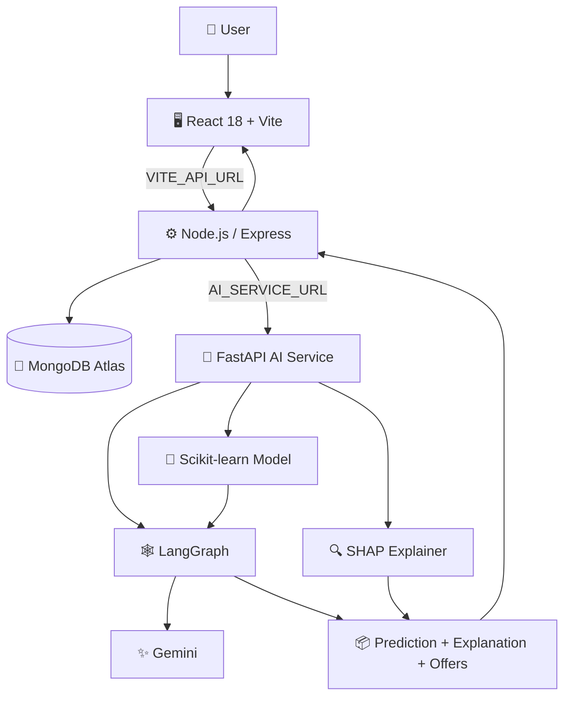

### 🔌 Service Architecture

| Service | Stack | Port |
|---|---|---:|
| 🖥️ Frontend | React 18 + Vite + nginx | `80` Docker / `5173` local |
| ⚙️ Backend | Node.js + Express + Mongoose | `5000` |
| 🤖 AI | FastAPI + scikit-learn + LangGraph + SHAP | `8001` Docker / `8000` local |
| 🍃 Database | MongoDB Atlas | Cloud |

### 🔗 Request Flow

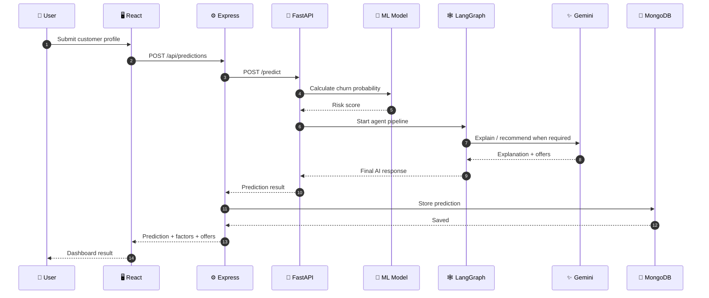

---

## 🧩 Services

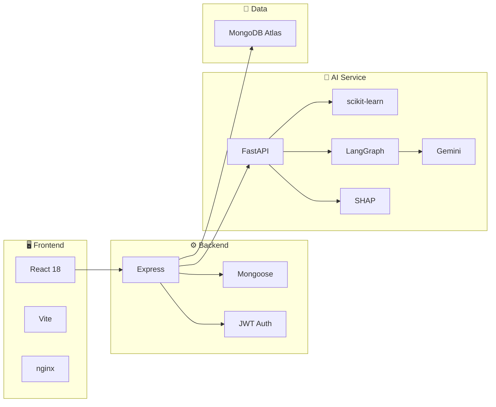

---

## 🚀 Features

- **Churn prediction** — Random Forest / Gradient Boosting / Logistic Regression trained on Telco dataset; best model selected by ROC-AUC.
- **LangGraph agent pipeline** — `score → explain → recommend` graph with conditional routing (Gemini called only for high/medium risk customers).
- **SHAP explainability** — per-customer feature-level SHAP values via `POST /shap`.
- **Retention offers** — up to 3 ranked offers (High / Medium / Low priority) generated by Gemini with rule-based fallback.
- **Role-based access** — three roles: `admin`, `employee`, `customer` — each sees a different dashboard.
- **Prediction history** — every prediction stored in MongoDB with factors, summary, and offers.
- **Interaction tracking** — support/complaint history per customer.

### 🎯 Feature Map

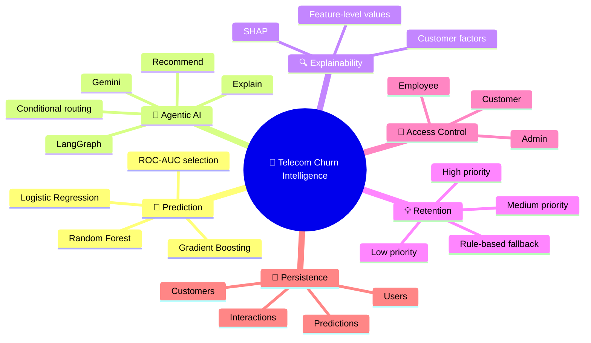

---

## 👥 Roles & Access

| Role | How created | What they can do |
|---|---|---|
| `admin` | `node seed-admin.js` (one-time) | Full access — manage employees, customers, view all predictions and stats |
| `employee` | Admin creates via dashboard | View/add/edit customers, run predictions, log interactions |
| `customer` | Public `/auth/register` | View own profile, plan, bills, support history |

> **Important:** Customers are the only role that can self-register. Employees are created by admin from the dashboard. Admin is seeded once via script.

### 🔐 RBAC Flow

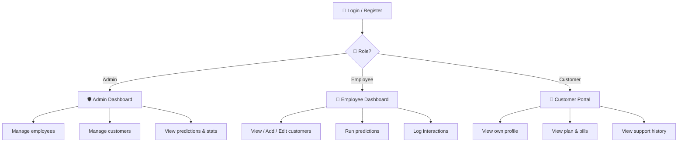

---

## 🔄 End-to-End Flow

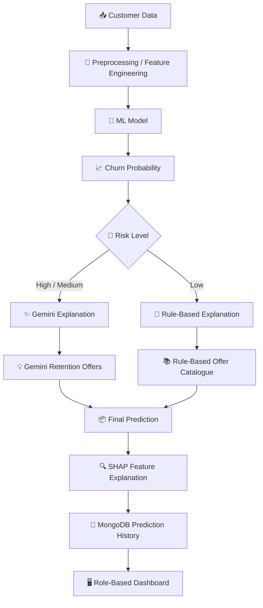

---

## 🤖 AI Pipeline — LangGraph

The prediction pipeline is a LangGraph state graph:

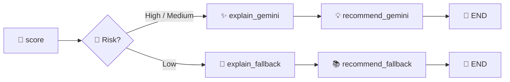

### 🧠 Agent Responsibilities

| Node | Responsibility |
|---|---|
| `score` | Classifies probability into `high / medium / low` |
| `explain_gemini` | Calls Gemini to write a 2–3 sentence plain-English explanation |
| `explain_fallback` | Rule-based summary for low-risk customers (no API call) |
| `recommend_gemini` | Calls Gemini for personalised retention offers (JSON) |
| `recommend_fallback` | Rule-based offer catalogue for low-risk customers |

The `risk_level` field is included in every `/predict` response.

### 🧩 Agent Decision Graph

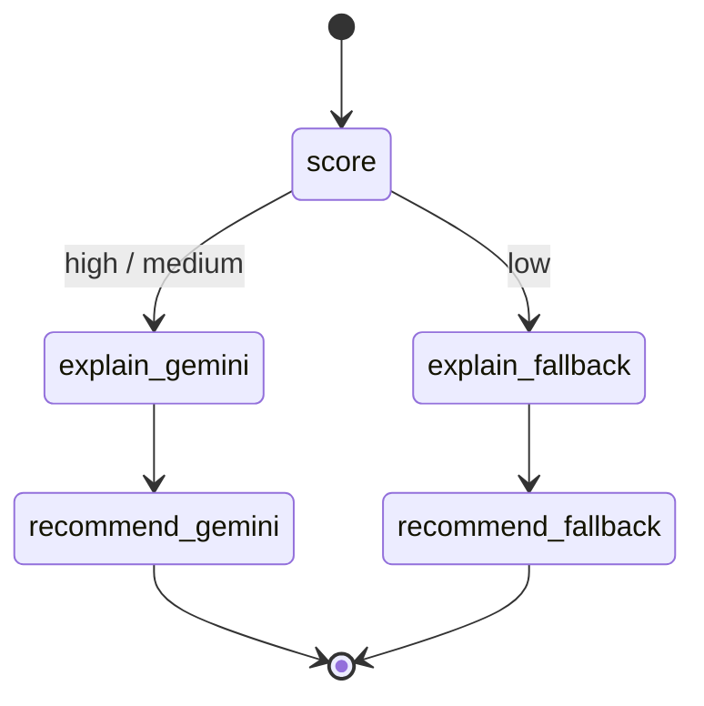

---

## 🧠 Machine Learning

### Dataset

**IBM Telco Customer Churn**

```text
ai/data/raw/telco_churn.csv
```

### 📌 Features Used

#### Numeric

- `tenure`
- `MonthlyCharges`
- `TotalCharges`
- `AvgMonthlyCharges`
- `TotalServices`

#### Categorical

- `Contract`
- `InternetService`
- `PaymentMethod`
- `TechSupport`
- `OnlineSecurity`
- `OnlineBackup`
- `DeviceProtection`
- `StreamingTV`
- `StreamingMovies`
- `PaperlessBilling`
- `gender`
- `SeniorCitizen`
- `Partner`
- `Dependents`
- `MultipleLines`
- `TenureGroup`

### ⚙️ Engineered Features

- `AvgMonthlyCharges`
- `TenureGroup`
- `TotalServices`

### 🏆 Models Trained

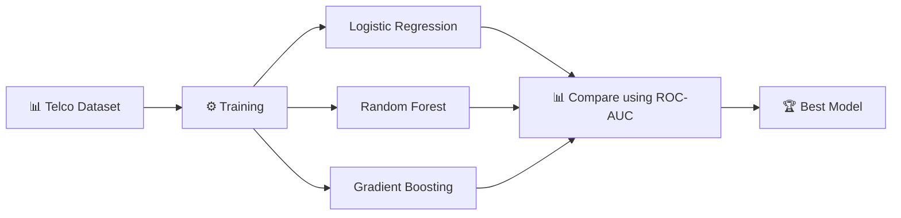

Models trained: **Logistic Regression, Random Forest, Gradient Boosting** — best selected by **ROC-AUC**.

### 🔁 Retrain

```bash
cd ai
python model/train.py
```

> The repository README does not provide the actual numeric training metrics here, so no accuracy/AUC values are fabricated in this document.

---

## 🔍 Explainability

SHAP provides **per-customer feature-level explainability**.

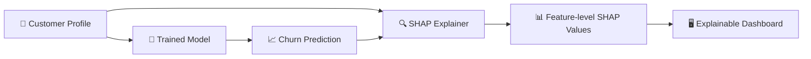

Endpoint:

```http
POST /shap
```

The AI service exposes SHAP values for a customer profile.

---

## 🗃️ Data & Prediction Flow

MongoDB stores:

- 👤 Customers
- 📈 Predictions
- 💬 Interactions
- 👥 Users

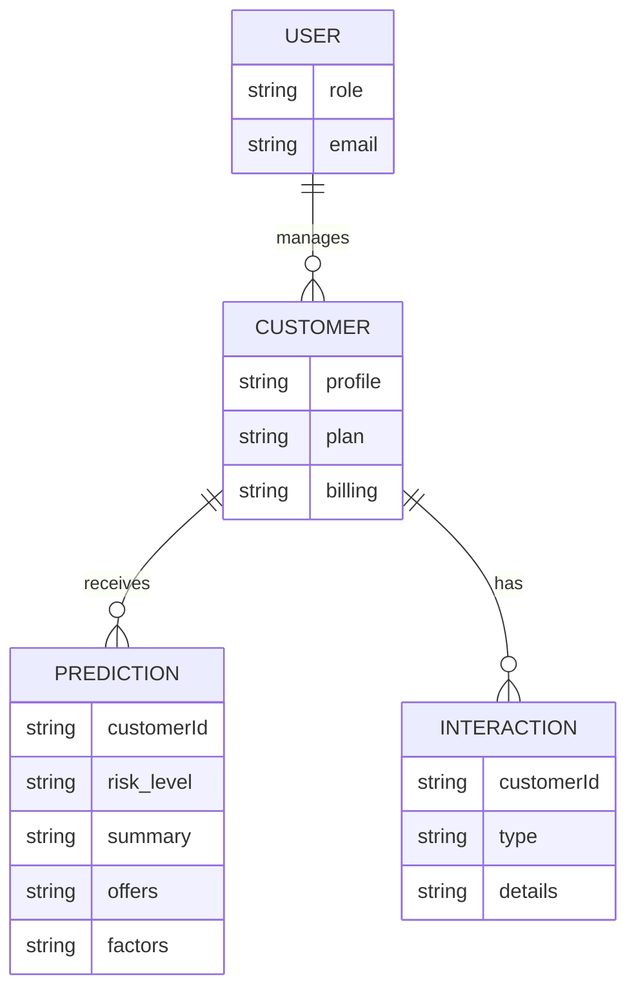

---

## ⚡ Quick Start

### Option 1 — Docker (recommended)

```bash
cp .env.example .env
# fill in your secrets

docker compose up --build
```

### 🌐 Services

| Service | URL |
|---|---|
| 🖥️ Frontend | `http://localhost:80` |
| ⚙️ Backend | `http://localhost:5000` |
| 🤖 AI | `http://localhost:8001` |

### Option 2 — Local

```bash
./run.sh local
```

Or manually:

### 🤖 AI Service

```bash
cd ai
python -m venv venv && source venv/bin/activate
pip install -r requirements.txt
python model/train.py
uvicorn main:app --reload --port 8000
```

### ⚙️ Backend

```bash
cd backend
npm install
npm run dev
```

### 🖥️ Frontend

```bash
cd frontend
npm install
npm run dev
# http://localhost:5173
```

---

## 🔐 First Admin Setup

After starting the backend for the first time, create the admin account:

```bash
cd backend
node seed-admin.js
```

### Default Credentials

```text
email:    admin@telecom.com
password: Admin@123
```

> ⚠️ **Security:** Change the default password immediately after the first login.

---

## 🔑 Environment Variables

Copy `.env.example` to `.env` in the project root and fill in:

```env
# AI Service
GEMINI_API_KEY=your_gemini_api_key

# Backend
PORT=5000
MONGO_URI=mongodb+srv://<user>:<password>@cluster.mongodb.net/churnDB
AI_SERVICE_URL=http://ai:8000
PASSWORD=your_db_password
JWT_SECRET=your_jwt_secret

# Frontend
VITE_API_URL=http://localhost:5000/api
```

| Variable | Used by | Purpose |
|---|---|---|
| `GEMINI_API_KEY` | AI service | Gemini LLM for explanation + retention offers |
| `MONGO_URI` | Backend | MongoDB Atlas connection string |
| `AI_SERVICE_URL` | Backend | Internal URL of the FastAPI service |
| `JWT_SECRET` | Backend | JWT signing secret |
| `PASSWORD` | Backend | DB password (also passed as env var) |
| `VITE_API_URL` | Frontend | Backend API base URL |

> 🔒 **Never commit `.env` or real credentials to Git.**

---

## 🌐 API Reference

### 🔐 Auth

| Method | Endpoint | Access | Description |
|---|---|---|---|
| `POST` | `/api/auth/register` | Public | Register as customer |
| `POST` | `/api/auth/login` | Public | Login (all roles) |
| `GET` | `/api/auth/me` | Protected | Get current user |

### 👥 Customers

| Method | Endpoint | Access | Description |
|---|---|---|---|
| `GET` | `/api/customers` | Protected | List all customers |
| `GET` | `/api/customers/:id` | Protected | Get customer by ID |
| `POST` | `/api/customers` | Admin / Employee | Add customer |
| `PUT` | `/api/customers/:id` | Admin / Employee | Update customer |
| `DELETE` | `/api/customers/:id` | Admin / Employee | Delete customer |
| `GET` | `/api/customers/me` | Customer | Own profile |
| `PATCH` | `/api/customers/me` | Customer | Update own profile |

### 📈 Predictions

| Method | Endpoint | Access | Description |
|---|---|---|---|
| `POST` | `/api/predictions` | Admin / Employee | Run churn prediction |
| `GET` | `/api/predictions` | Admin / Employee | All predictions |
| `GET` | `/api/predictions/:customerId` | Protected | Customer prediction history |

### 👨‍💼 Users (Employees)

| Method | Endpoint | Access | Description |
|---|---|---|---|
| `GET` | `/api/users/employees` | Admin | List all employees |
| `POST` | `/api/users/employees` | Admin | Create employee |
| `DELETE` | `/api/users/employees/:id` | Admin | Delete employee |

### 🤖 AI Service

| Method | Endpoint | Description |
|---|---|---|
| `GET` | `/health` | Liveness probe |
| `GET` | `/model-info` | Training metrics (model name, AUC, accuracy) |
| `POST` | `/predict` | Full prediction + LangGraph pipeline |
| `POST` | `/shap` | SHAP values for a customer profile |

---

## 📁 Project Structure

```text
Telecom-Churn-Intelligence/
├── ai/
│   ├── agents/
│   │   ├── graph.py            # LangGraph pipeline
│   │   ├── reason_agent.py     # Gemini explanation
│   │   ├── retention_agent.py  # Gemini retention offers
│   │   └── response_agent.py   # Calls graph.run_pipeline()
│   ├── model/
│   │   ├── train.py            # Train + save best model
│   │   ├── predict.py          # Load model + score customer
│   │   └── preprocess.py       # ETL pipeline
│   ├── gemini.py               # Gemini API wrapper
│   ├── main.py                 # FastAPI app (/predict, /shap, /health)
│   └── requirements.txt
├── backend/
│   ├── controllers/            # Route handlers
│   ├── middleware/             # JWT auth + role guard
│   ├── models/                 # Mongoose schemas (User, Customer, Prediction, Interaction)
│   ├── routes/                 # Express routers
│   ├── seed-admin.js           # One-time admin seed script
│   └── server.js
├── frontend/
│   ├── src/
│   │   ├── components/         # Reusable UI components
│   │   ├── pages/
│   │   │   ├── admin/          # Admin dashboard pages
│   │   │   ├── employee/       # Employee dashboard pages
│   │   │   └── customer/       # Customer portal pages
│   │   ├── context/             # AuthContext
│   │   └── services/api.js      # Axios API client
│   ├── nginx.conf
│   └── Dockerfile
├── terraform/                  # AWS infrastructure (EC2, VPC, ECR)
├── notebooks/                  # EDA + model comparison
├── docker-compose.yml
├── run.sh                      # ./run.sh [docker|local]
├── terraform.sh                # ./terraform.sh [start|stop|status|ssh]
└── .env.example
```

---

## 🔁 CI/CD

GitHub Actions pipeline (`.github/workflows/ci-cd.yml`):

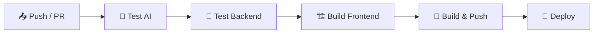

### Pipeline Steps

1. **Test AI** — installs Python deps, smoke-tests `preprocess` import + `shap` import.
2. **Test Backend** — `npm ci` + `node --check server.js`.
3. **Build Frontend** — `npm ci` + `npm run build`.
4. **Build & Push** — builds Docker images, pushes to AWS ECR (main branch only).
5. **Deploy** — SSH into EC2, pulls latest images, runs `docker compose up -d`.

### 🔑 Required GitHub Secrets

```text
AWS_ACCOUNT_ID
AWS_ACCESS_KEY_ID
AWS_SECRET_ACCESS_KEY
EC2_HOST
EC2_USER
EC2_SSH_KEY
GEMINI_API_KEY
MONGO_URI
DB_PASSWORD
JWT_SECRET
```

---

## ☁️ Infrastructure — Terraform

### 🏗️ Infrastructure Diagram

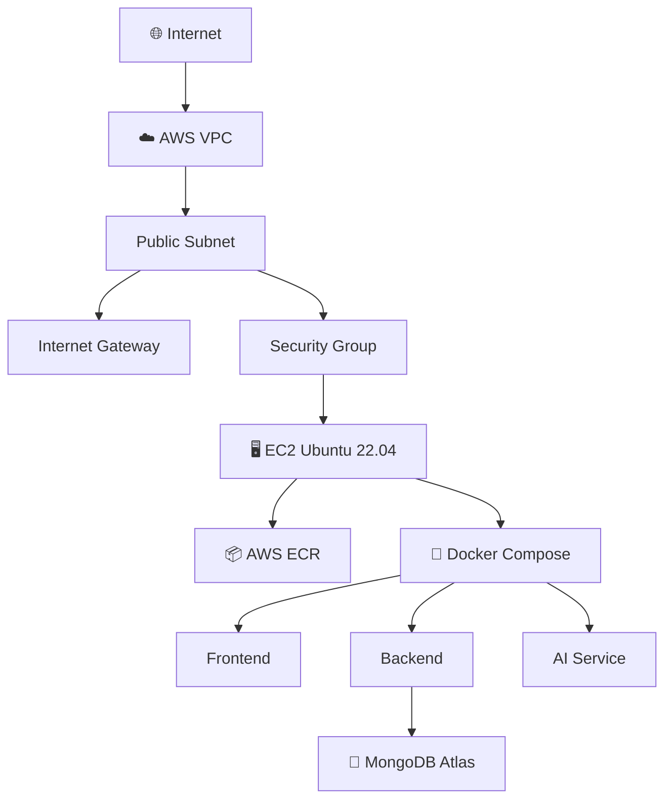

### Commands

```bash
# Set env vars
export AWS_ACCESS_KEY_ID=...
export AWS_SECRET_ACCESS_KEY=...
export TF_VAR_gemini_api_key=...
export TF_VAR_mongo_uri='mongodb+srv://...'
export TF_VAR_db_password=...
export TF_VAR_ssh_public_key="$(cat ~/.ssh/id_rsa.pub)"

./terraform.sh start    # provision EC2 + VPC + ECR
./terraform.sh status   # show IPs and URLs
./terraform.sh ssh      # SSH into EC2
./terraform.sh stop     # destroy all resources
```

### ☁️ Provisions

- VPC
- Public subnet
- Internet gateway
- Security group
- Elastic IP
- EC2 — Ubuntu 22.04, `t3.small`, 30GB `gp3`
- 3 ECR repositories

---

## 🐳 Docker

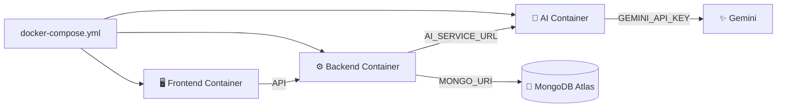

### Docker Services

| Container | Purpose | Port |
|---|---|---:|
| Frontend | React + nginx | `80` |
| Backend | Node.js + Express | `5000` |
| AI | FastAPI + ML + agents | `8001` |

---

## 🛡️ Security Notes

- Keep `GEMINI_API_KEY`, `MONGO_URI`, `JWT_SECRET`, and database credentials in environment variables.
- Do not commit real secrets to GitHub.
- Change the seeded admin password after first login.
- GitHub Actions secrets should contain deployment credentials rather than hard-coded values.
- Restrict MongoDB Atlas network access appropriately for the deployment environment.
- Use least-privilege AWS IAM permissions for CI/CD.

---

## 📌 Tech Stack

### Frontend
- React 18
- Vite
- nginx
- Axios

### Backend
- Node.js
- Express.js
- Mongoose
- JWT authentication

### AI / ML
- Python
- FastAPI
- scikit-learn
- Logistic Regression
- Random Forest
- Gradient Boosting
- LangGraph
- Gemini
- SHAP

### Database
- MongoDB Atlas

### DevOps / Cloud
- Docker
- Docker Compose
- GitHub Actions
- AWS ECR
- AWS EC2
- Terraform
- VPC

---

## 🧭 System Summary

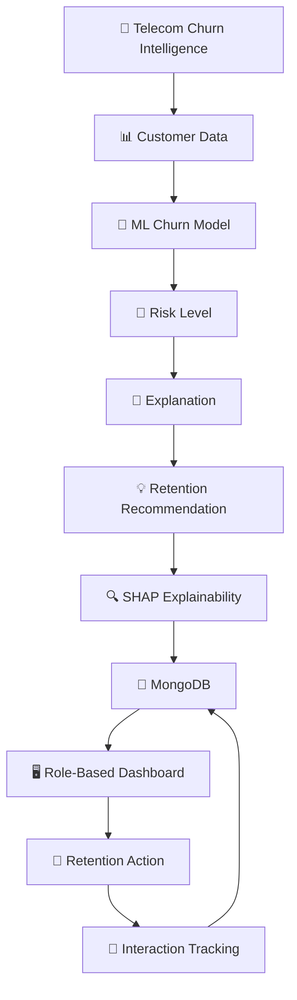

> **Architecture philosophy:** combine deterministic ML scoring with explainable AI and agentic retention recommendations, while keeping low-risk paths on rule-based fallbacks to avoid unnecessary LLM calls.

---

## 📄 Original Technical Coverage Preserved

This README retains the original project scope and implementation details:

- React/Vite frontend
- Node.js/Express/Mongoose backend
- FastAPI AI service
- MongoDB Atlas persistence
- Random Forest / Gradient Boosting / Logistic Regression
- ROC-AUC based model selection
- LangGraph `score → explain → recommend` pipeline
- Gemini explanation and retention agents
- Rule-based fallbacks
- SHAP explainability
- Admin / Employee / Customer roles
- Prediction history
- Interaction tracking
- Docker deployment
- GitHub Actions CI/CD
- AWS ECR / EC2
- Terraform infrastructure
- Existing API endpoints
- Existing environment variables
- Existing project structure
- Existing run and deployment commands

---

## ⭐ Project Flow at a Glance

**Customer → ML Prediction → Risk Level → AI Explanation → Retention Offer → SHAP Insights → MongoDB → Dashboard → Retention Action**

**Built with:** React • Node.js • Express • FastAPI • scikit-learn • LangGraph • Gemini • SHAP • MongoDB Atlas • Docker • GitHub Actions • AWS • Terraform
